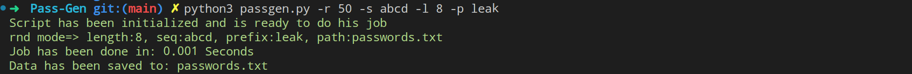

# Pass list generator

It's a python script that can be used to generate a list of passwords and save them to the file. You can use different switches to achieve what you want in the simplest  way.

## Usage:

The script has some switches that can be used to define different scenarios. All of them all optional and it's not any force to use them. They are:

+ **Mode**: By default, it is in all-mode (-a) and tries to make all possible combinations of a given sequence. But you can choose (-r) to change this manner and request generating of limited passwords in random mode. Be aware if your selection is the random mode, then you should pass a value to it to define how many passwords you want to be generated.

    Note: The all-mode will create all possible un-repeated combinations and based on settings may take much time to do. But in the random mode, you can add some limitations to speed up the process but the result does not cover all combinations and it is possible generation repeated passwords even if the chance is very low.

+ **Sequence**: By default use a set of all digits, ascii chars, and punctuation to make passwords. But you can change this behavior with using (-s) and passing a sequence to it.

+ **Default length**: It's 5 char length for every password, if we do not customize the length. The (-l) assigned to this option.
+ **Prefix**: The word that can be add to start of every password as a prefix and by default it does not adding anything. Change it if you want with (-p).
+ **Output**: The path to save the list. It will save in passwords.txt in the current directory by default and will customize by (-o).

It's time to see a simple example without any customization:

```bash
python3 passgen.py
```

Now let to do some impact on the default settings. Imagine this scenario and see how we should define it: 

+ **mode**: random mode
+ **sequence**: abcd
+ **length**: 8
+ **prefix**: leak
+ **Random generation Count**: 50

```bash
python3 passgen.py -r 50 -s abcd -l 8 -p leak
```


    